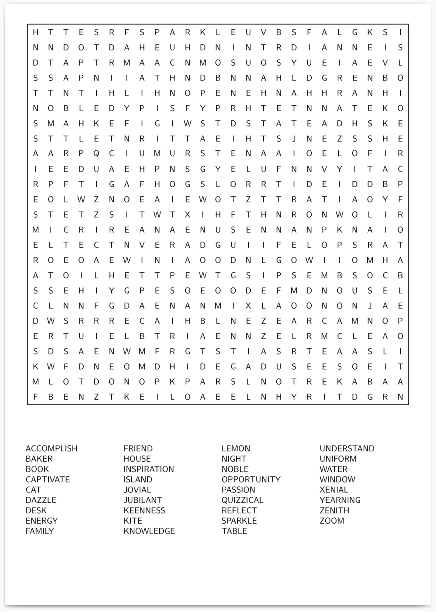

# Wordsearch Generator

Python script to generate LaTex Wordsearches

## Features

* Up to 25 x 25 sized word searches
* Provide your own word list
* Filler letters are distributed according to frequency in the English language
* Answer sheet is also generated
* Utility script to automatically generate the final pdf with one command

## Examples




## Prerequisites

* The python script itself is pure python with no libraries required
* `pdflatex` is required to generate the PDFs
    * The following LaTex packages are used. Make sure these are available on your platform
        * `geometry`
        * `xcolor`
        * `multicol`
        * `easytable`
        * `xcolor`

## Running

To generate the LaTex itself, simply run

```bash
python wordsearch-tex-gen.py
```

provding the required arguments (run `python wordsearch-tex-gen.py --help` for more information).

Here is an example that generates a PDF with a single command

```bash
python wordsearch-tex-gen.py --width 10 --height 10 words.txt | ./pdflatex-pipe >out.pdf
```

If you wish, you could take this further to generate a whole book!

```bash
for i in $(seq 20); do python wordsearch-tex-gen.py --width 20 --height 20 words.txt | ./pdflatex-pipe >out/ws${i}.pdf; done

pdfunite out/ws*.pdf out/combine-ws.pdf
```
